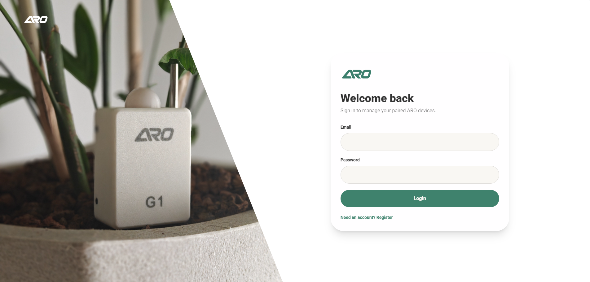
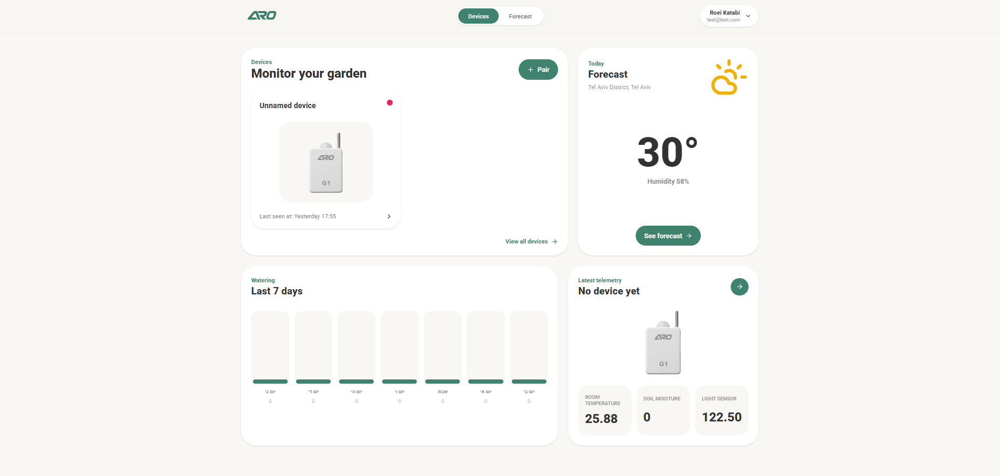
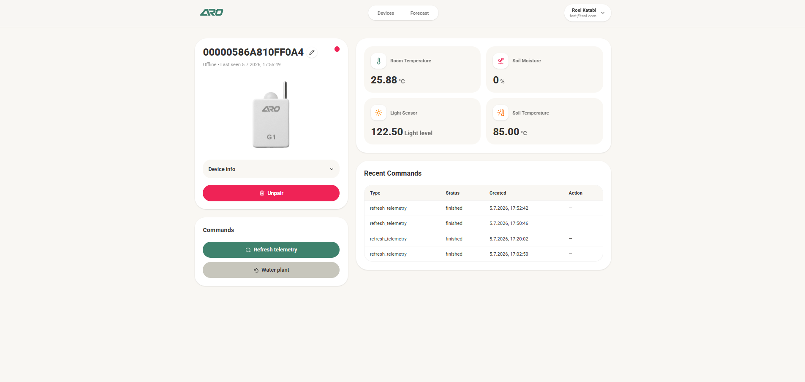
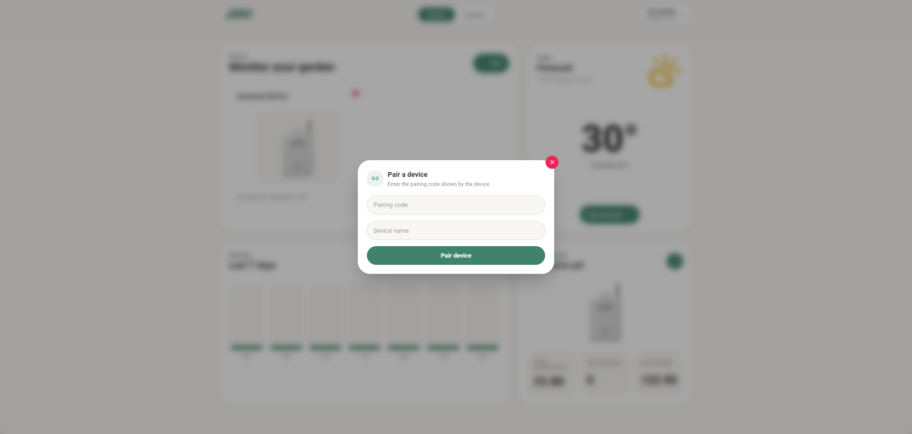
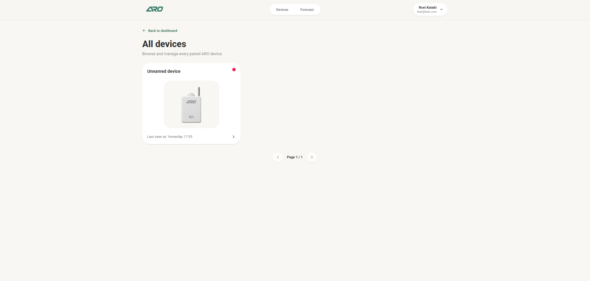

# 🌱 GrowMate Web

GrowMate Web is the official web dashboard for the **ARO G1** smart plant monitoring system.

The application allows users to register, authenticate, pair devices, monitor environmental telemetry, and remotely control their devices from a clean, responsive web interface.

---

## Features

- Secure user authentication
- Login & Registration
- Device pairing using pairing codes
- Device management dashboard
- Live telemetry visualization
- Remote device commands
- Responsive UI

---

## Built With

### Frontend

- React
- Vite
- Redux Toolkit
- React Router
- Tailwind CSS
- Axios
- Lucide React

### Backend

The frontend communicates with the GrowMate REST API.

Main features include:

- JWT Authentication
- Device Management
- Pairing
- Telemetry
- Remote Commands

---

# Project Structure

```text
src/
│
├── assets/                 Images & static assets
├── components/             Shared UI components
├── features/
│   ├── auth/
│   ├── devices/
│   └── ...
├── pages/
│   ├── LoginPage.jsx
│   ├── Dashboard.jsx
│   └── ...
├── services/               API layer
├── store/                  Redux store
├── App.jsx
└── main.jsx
```

---

# Authentication

The application uses JWT authentication.

Users can:

- Register
- Login
- Receive a JWT
- Access protected routes
- Logout

Authentication state is managed using Redux Toolkit.

---

# Device Pairing

Devices are paired using a unique pairing code generated during the ARO G1 (For example) setup process.

Once paired, the device becomes associated with the authenticated user and can be managed through the dashboard.

---

# Dashboard

The dashboard provides:

- Device overview
- Live telemetry
- Device status
- Remote commands
- Device management

---

# Telemetry

Displays real-time environmental data collected by the G1 Device.

Depending on firmware capabilities, telemetry may include:

- Soil Moisture
- Air Temperature
- Soil Temperature
- Humidity
- Light Intensity
- Device Status

---

# Remote Commands

Users can remotely send commands to their paired devices.

Examples include:

- Water plant
- Request telemetry

---

# Screenshots

## Login



---

## Dashboard



---

## Device Details



---

## Pair Device



---

## Device Management




---

# UI Gallery

| Login | Dashboard |
|--------|-----------|
|  |  |

| Devices | Pair Device |
|----------|-------------|
|  |  |


---

# Design

The interface follows the ARO design language:

- Soft rounded corners
- Light neutral palette
- Green accent colors
- Responsive layout
- Glassmorphism-inspired cards
- Minimalist typography

---

# License

This project is proprietary software.

© ARO. All rights reserved.